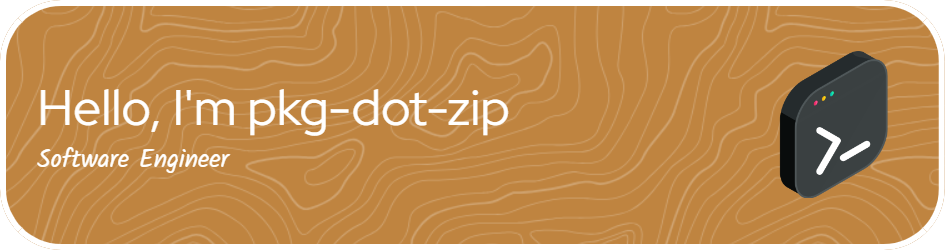

Hi My name is Simon
=============================================================================================================================

Software Engineer
-----------------

I've been messing around with programming and computers for as long as I can remember, but my career really started in 2019 when I started programming some complex projects in Java. Since then, I've mastered C#, Kotlin and C as well. Recently I've been messing around with JS as well, but nothing beats actual programming languages.

* 🖥️  See my portfolio at [pkg-dot-zip.com](http://www.pkg-dot-zip.com/)
* 🤝  I'm open to collaborating on anything remotely interesting

### Skills

### Socials

 <a href="https://www.github.com/pkg-dot-zip" target="_blank" rel="noreferrer"> <picture> <source media="(prefers-color-scheme: dark)" srcset="https://raw.githubusercontent.com/danielcranney/readme-generator/main/public/icons/socials/github-dark.svg" /> <source media="(prefers-color-scheme: light)" srcset="https://raw.githubusercontent.com/danielcranney/readme-generator/main/public/icons/socials/github.svg" />  </picture> </a> <a href="https://www.linkedin.com/in/pkg-dot-zip" target="_blank" rel="noreferrer"> <picture> <source media="(prefers-color-scheme: dark)" srcset="https://raw.githubusercontent.com/danielcranney/readme-generator/main/public/icons/socials/linkedin-dark.svg" /> <source media="(prefers-color-scheme: light)" srcset="https://raw.githubusercontent.com/danielcranney/readme-generator/main/public/icons/socials/linkedin.svg" />  </picture> </a> <a href="https://www.x.com/meneerdegrootnl" target="_blank" rel="noreferrer"> <picture> <source media="(prefers-color-scheme: dark)" srcset="https://raw.githubusercontent.com/danielcranney/readme-generator/main/public/icons/socials/twitter-dark.svg" /> <source media="(prefers-color-scheme: light)" srcset="https://raw.githubusercontent.com/danielcranney/readme-generator/main/public/icons/socials/twitter.svg" />  </picture> </a>

### Badges

<b>My GitHub Stats</b>

